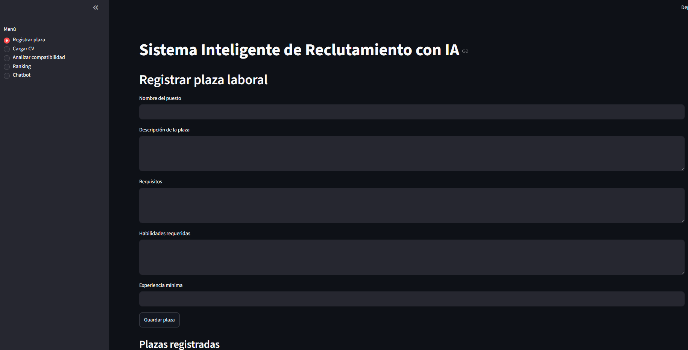
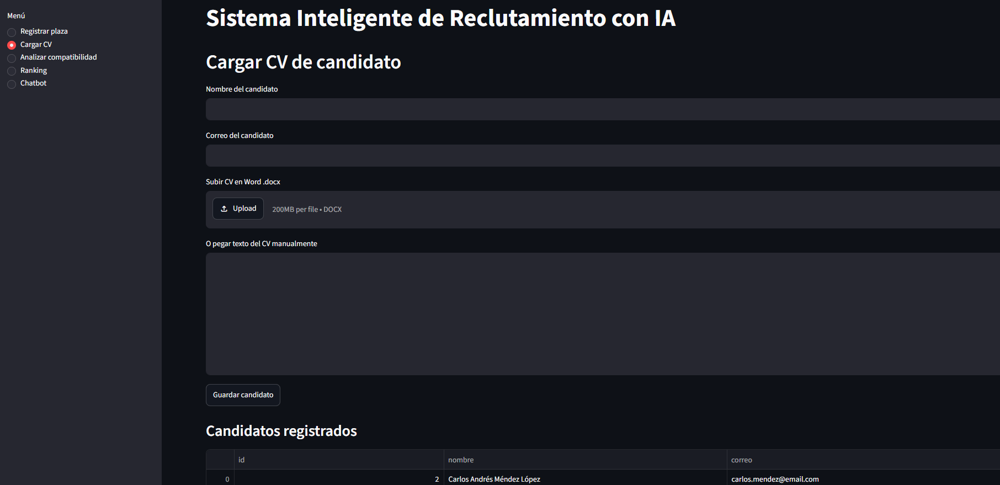
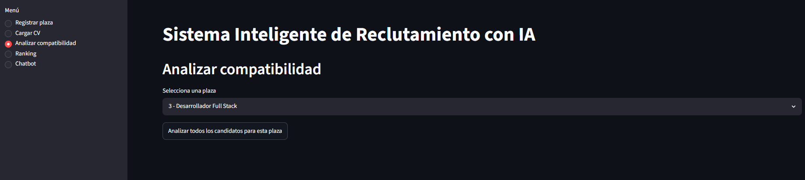
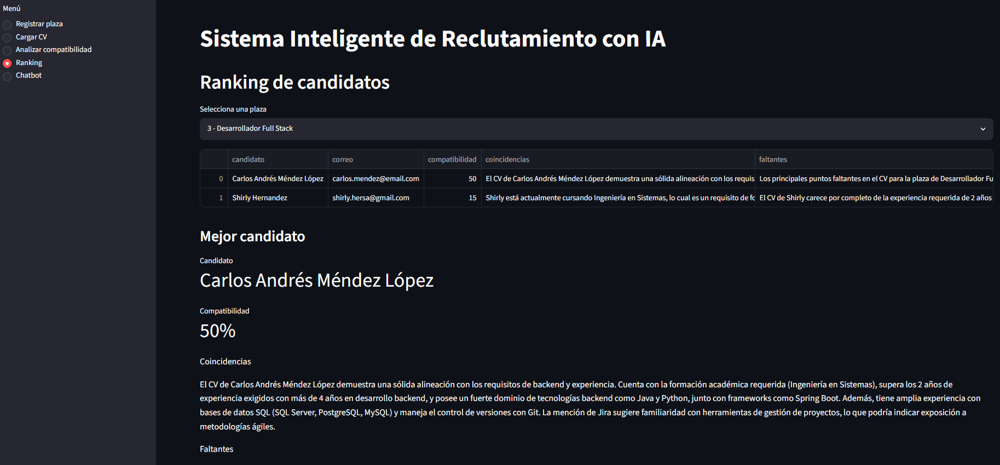
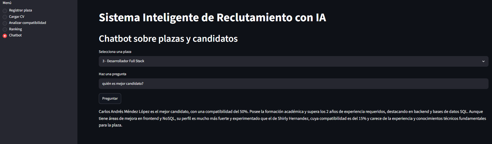

#integrantes del equipo
Shirly Eunice Hernandez Saquic 3190 15 8021

Glendy Maribel González Guite 090 19 1823

Martir Alexander Vasquez 5190-17-17289

# sistema-reclutamiento-ia
Proyecto Inteligencia Artifical sobre un sistema de reclutamiento

## Descripción del proyecto

El **Sistema Inteligente de Reclutamiento con IA** es una demo funcional desarrollada para apoyar el proceso de selección de personal mediante inteligencia artificial.

El sistema permite registrar plazas laborales, cargar CVs de candidatos, analizar la compatibilidad entre el perfil del candidato y la plaza, generar un ranking de candidatos y utilizar un chatbot para realizar consultas sobre los resultados obtenidos.

## Problema identificado

En muchos procesos de reclutamiento, la revisión de CVs se realiza de forma manual. Esto puede generar:

* Tiempo excesivo en la revisión de candidatos.
* Posibles errores humanos.
* Sesgo en la evaluación inicial.
* Información desorganizada.
* Dificultad para comparar candidatos bajo los mismos criterios.

## Objetivo

Apoyar el proceso de reclutamiento con inteligencia artificial, reduciendo la carga operativa del equipo de recursos humanos y permitiendo que el sistema analice, evalúe y clasifique candidatos de forma más rápida, organizada y objetiva.

## Tipo de sistema

El proyecto puede clasificarse como un **Sistema de Soporte a Decisiones**, ya que no reemplaza al reclutador, sino que le proporciona información útil para tomar mejores decisiones.

Además, incorpora elementos de:

* Sistema basado en reglas.
* Inteligencia artificial generativa.
* Sistema de recomendación.
* Procesamiento de Lenguaje Natural.
* Chatbot interactivo.

## Enfoque de inteligencia artificial

### Procesamiento de Lenguaje Natural

El sistema utiliza procesamiento de lenguaje natural para interpretar y analizar el contenido textual de los CVs y las plazas laborales.

Esto permite identificar experiencia, habilidades, requisitos y coincidencias entre el perfil del candidato y el puesto.

### Sistema de recomendación

El sistema genera una recomendación basada en la compatibilidad entre el CV y la plaza registrada.

Con esto se construye un ranking de candidatos, ordenado del perfil más compatible al menos compatible.

### Chatbot interactivo

El sistema incluye un chatbot que permite realizar preguntas sobre la plaza, los candidatos y los resultados del análisis.

Por ejemplo:

* ¿Cuál es el mejor candidato?
* ¿Por qué fue recomendado?
* ¿Qué habilidades le faltan?
* ¿Qué preguntas se pueden hacer en una entrevista?

## Herramientas utilizadas

 Herramienta         Uso en el proyecto                 
 -*-*-*-*-*-*-*-*-*-*-*-*-*-*-*-*-*-*-*-* 
 Python              Lenguaje principal de programación 
 Streamlit           Creación de la interfaz web       
 SQLite              Base de datos local               
 Gemini API          Motor de inteligencia artificial   
 Google AI Studio    Gestión de la API Key              
 python-docx         Lectura de archivos Word `.docx`    
 Visual Studio Code  Entorno de desarrollo              

## Funcionamiento general

El sistema funciona mediante el siguiente flujo:

1. El reclutador registra una plaza laboral.
2. Se carga el CV del candidato en formato Word `.docx` o mediante texto manual.
3. El sistema extrae y procesa la información del CV.
4. La IA compara el contenido del CV con los requisitos de la plaza.
5. Se genera un porcentaje de compatibilidad.
6. Se muestran coincidencias, faltantes, explicación y recomendación.
7. Se construye un ranking de candidatos.
8. El chatbot permite consultar información sobre los resultados.

## Módulos del sistema

### 1. Módulo de registro de plazas

Permite registrar la información de una plaza laboral.

Campos principales:

* Nombre del puesto.
* Descripción.
* Requisitos.
* Habilidades requeridas.
* Experiencia mínima.

Este módulo sirve como base para que la IA pueda comparar posteriormente los CVs de los candidatos.

### 2. Módulo de carga de CV

Permite registrar candidatos y cargar su información curricular.

El sistema acepta:

* Archivo Word en formato `.docx`.
* Texto pegado manualmente.

La opción de texto manual se incluye como respaldo para evitar problemas durante la demo si un archivo no se lee correctamente.

### 3. Módulo de análisis de compatibilidad

Este módulo compara la plaza seleccionada con los CVs registrados.

La IA analiza:

* Experiencia del candidato.
* Habilidades declaradas.
* Requisitos solicitados.
* Relación entre el perfil y el puesto.

Como resultado genera:

* Porcentaje de compatibilidad.
* Coincidencias.
* Habilidades o requisitos faltantes.
* Explicación del resultado.
* Recomendación.
* Preguntas sugeridas para entrevista.

### 4. Módulo de ranking

Muestra los candidatos ordenados según su porcentaje de compatibilidad.

Este módulo permite visualizar rápidamente qué candidatos son más adecuados para la plaza seleccionada.

El ranking ayuda al reclutador a priorizar candidatos para entrevista.

### 5. Módulo de chatbot

Permite hacer preguntas sobre la plaza y los candidatos analizados.

El chatbot usa la información del ranking y de la plaza seleccionada para responder preguntas relacionadas con el proceso de reclutamiento.

Ejemplos de preguntas:

* ¿Cuál es el mejor candidato?
* ¿Por qué este candidato fue recomendado?
* ¿Qué habilidades le faltan?
* ¿Qué preguntas puedo hacerle en entrevista?

## Seguridad

Por seguridad, el archivo `.env` no debe subirse a GitHub.

Se debe subir únicamente un archivo `.env.example` con la estructura de ejemplo.

## Archivo .env.example

```env
GEMINI_API_KEY=TU_API_KEY_AQUI
```

## Limitaciones de la demo

Esta versión corresponde a una demo académica, por lo que tiene algunas limitaciones:

* No incluye login de usuarios.
* No maneja roles avanzados.
* No utiliza base de datos en la nube.
* No analiza archivos PDF escaneados.
* No reemplaza el criterio humano del reclutador.
* Depende de una API externa para el análisis de IA.

## Conclusión

El Sistema Inteligente de Reclutamiento con IA demuestra cómo se pueden integrar desarrollo web, base de datos e inteligencia artificial para apoyar el proceso de selección de personal.
La solución permite reducir tiempo, organizar información, generar recomendaciones y apoyar al reclutador en la toma de decisiones.
El sistema no busca sustituir al reclutador, sino funcionar como una herramienta de apoyo para mejorar el análisis inicial de candidatos.

##Imagenes
## Capturas del sistema

### Registro de plaza



### Carga de CV



### Análisis de compatibilidad



### Ranking de candidatos



### Chatbot




